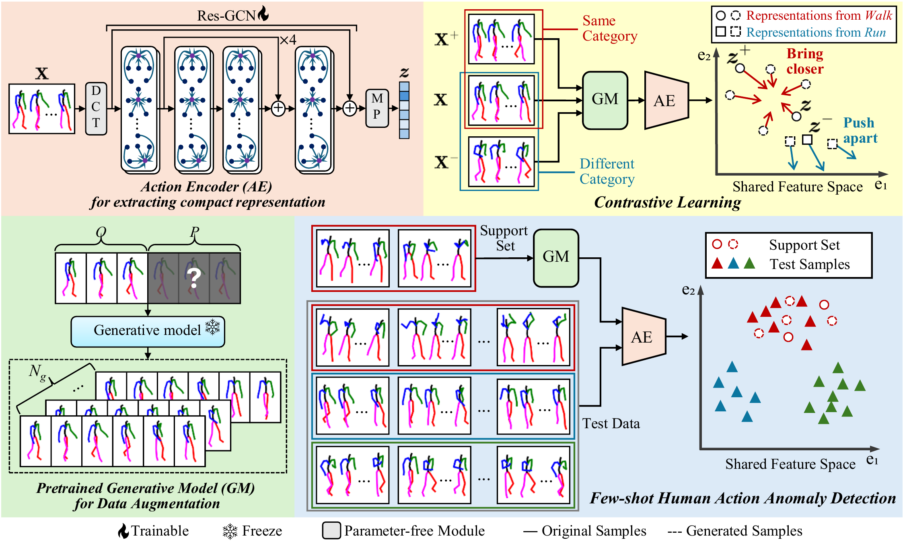

# Few-shotHAAD
Official implementation of [**"Few-shot human action anomaly detection via a unified contrastive learning framework"**](https://www.sciencedirect.com/science/article/pii/S0950705125021689), [Knowledge-Based Systems](https://www.sciencedirect.com/journal/knowledge-based-systems).

Overview of the proposed framework:



## :construction_worker: Installation
### 1. Create conda environment
From the repository root, run:
```bash
bash prepare/create_env.sh
conda activate haad
```
The code was tested on **Python 3.8** and **PyTorch 1.7.1**.

### 2. Download the HumanAct12 dataset
**Important:** Please follow the original dataset license/terms and cite the dataset accordingly.

Please download the post-processed HumanAct12 file by following the instructions in the ACTOR project:
- [ACTOR dataset page](https://github.com/Mathux/ACTOR/blob/master/DATASETS.md)

After downloading, extract the archive and place the extracted file at:
```text
data/HumanAct12Poses/humanact12poses.pkl
```

### 3. Download the checkpoints
From the repository root, run:
```bash
bash prepare/download_checkpoint.sh
```
This script downloads the checkpoint archive from Google Drive and places the files as:
```text
checkpoints_paper/
├── encoder.p
└── humanmac.pt
```


## :rocket: Run Experiments
### :fire: Training
From the repository root, run:
```bash
bash run_train.sh
```
### :clipboard: Evaluation
From the repository root, run:
```bash
bash run_test.sh
```


## :handshake: Acknowledgements
This work was supported by JSPS KAKENHI Grant Number 23K10712.

We thank the authors of the datasets and open-source projects used in this repository and our experiments, including:
- **[HumanAct12](https://ericguo5513.github.io/action-to-motion/):** We used HumanAct12 for evaluation and benchmarking.
- **[ACTOR](https://github.com/Mathux/ACTOR):** We refer to ACTOR for dataset preparation instructions and related resources.
- **[HumanMAC](https://github.com/LinghaoChan/HumanMAC):** This repository includes code adapted from HumanMAC (MIT License).
- **[PyTorch3D](https://github.com/facebookresearch/pytorch3d):** This repository includes code adapted from PyTorch3D (BSD 3-Clause).

See [`NOTICE.md`](NOTICE.md) for third-party license notices.


## License
This code is distributed under the [MIT License](LICENSE).

This repository uses third-party libraries and datasets (e.g., PyTorch3D, HumanMAC, HumanAct12), each of which has its own license/terms that must also be followed.


## :clip: Citation
Please consider citing our paper if you find it helpful in your research:
```text
@article{kamide2025few,
  title={Few-shot human action anomaly detection via a unified contrastive learning framework},
  author={Kamide, Koichiro and Sakai, Shunsuke and Maeda, Shun and Gu, Chunzhi and Zhang, Chao},
  journal={Knowledge-Based Systems},
  pages={115133},
  year={2025},
  publisher={Elsevier}
}
```